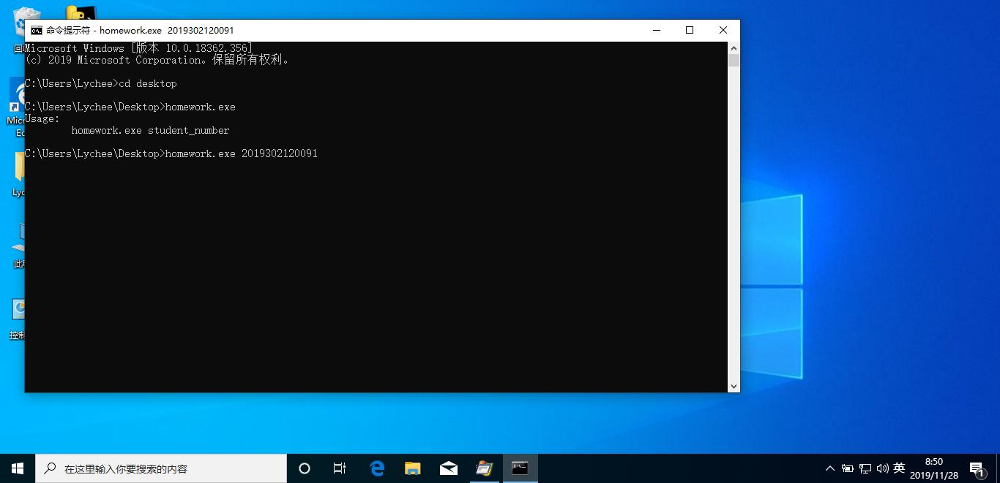

#**我的第一次进程分析**

[进程分析]

##**运行homework.exe**
运行cmd并依次输入以下命令：
>cd C:\Users\Lychee\Desktop

>dir

（注：此命令也可以省略。dir主要是用于显示某个文件夹目录下的内容，便于我们更好确定文件的路径。)

>homework.exe 2019302120091
.png)

##**使用processmonitor**

>1.设置过滤器
path contains jpg include
或
path endwith jpg include
或
imagepath isnot C:\Users\Lychee\Desktop\homework.exe 2019302120091 exclude
.png)

2.点击过滤出的内容，点击add,点apply

3.返回到上一级页面，找到过滤出的内容，点右键，点jump to
.png)

4.查找到homework.exe对电脑的操作行为，即对屏幕进行截图。

###**一点点感受**
1.使用过滤器不能重复使用过多，要及时使用reset filter重置过滤器并再次过滤；

2.过滤器的选择对错很重要；多种过滤器都能对目标文件进行筛选；

3.了解了dir命令的用途。

